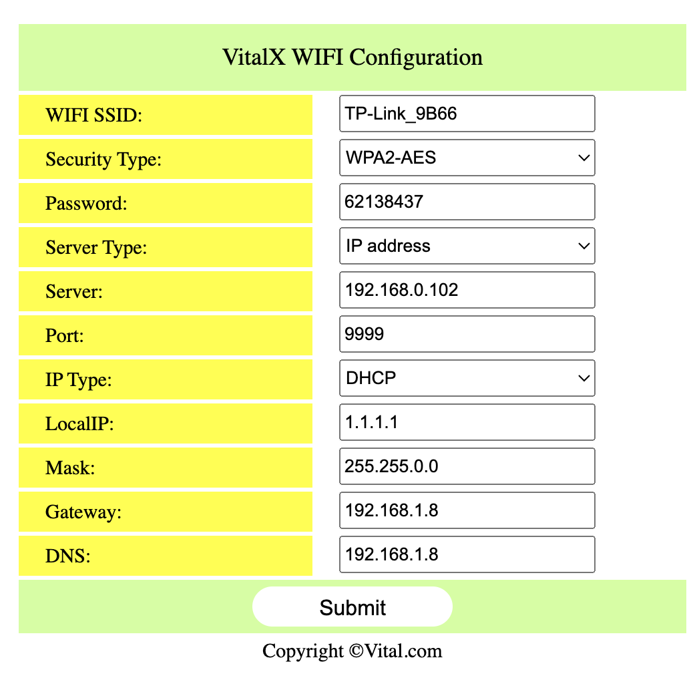

# Setup the Netatmo Smart Home Weather Station
1. Go to Postman Agent
https://lively-firefly-796610.postman.co/workspace/Netatmo-API-Workspace~ee26662a-916d-48b3-91bd-81150fb74de4/request/34545069-0c0b1a05-fe83-410c-b10e-ac3b201da2e6?tab=body
2. Do POST method on web browser: 
https://api.netatmo.com/oauth2/authorize?
    client_id=661bf9e724dee9b54004f63b
    &redirect_uri=http://localhost:8080/callback
    &scope=read_homecoach
    &state=xyz123
3. Accept access
4. then copy the code from the link and replace the body params `code` in Postman
5. copy the access_token and refresh_token from the JSON output to the `ACCESS_TOKEN` & `REFRESH` here. 
6. Redo this step each time you stop recording (ctrl c)
7. **If error: 
https://dev.netatmo.com/apidocumentation/aircare#gethomecoachsdata 
and execute the gethomecoachsdata, copy the access code to netatmo.py 
70:ee:50:25:91:50

# Setup the motion sensor 
1. Turn on the TP link wifi & Hue Bridge 

# Setup the UWB radar 
1. Turn on the switch 
2. Connect laptop to the UWB radar wifi: `VitalX_94:c9:60:01:71:ac`
3. Load 192.168.1.8 on web browser
    - Check server on LAPTOP (not phone) is '192.168.0.104' which is the IP address of `TP-Link_9B66`
    - Password is the password for the TP link wifi 
    - Try changing something so it actually loads: change the Port number and then change accordingly on main.py
4. Ensure the radar light is Green

# RUN
1. On one side, run run.sh that runs netatmo and motion sensor
2. on the second side, cd into Intellicare-Reader-master, and run python3 main.py

15:49.39 + 